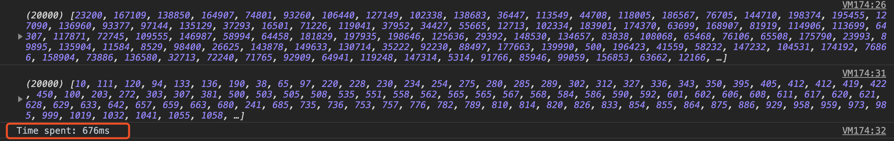
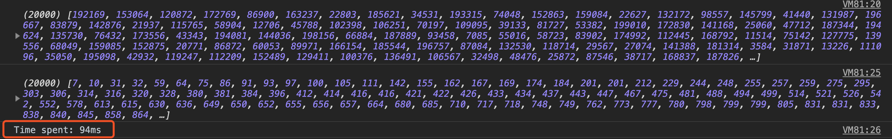
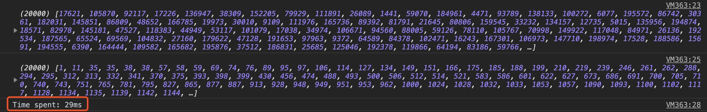
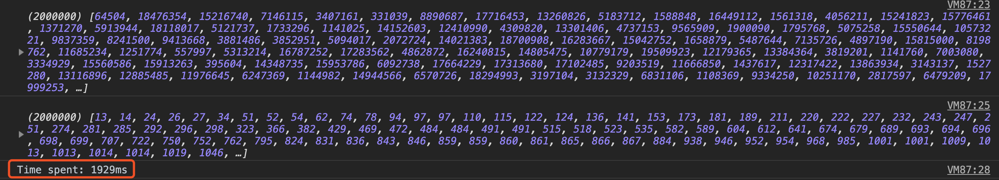

# 几种排序算法的JavaScript实现

## 冒泡排序
```javascript
function swap(arr, a, b) {
    let temp = arr[a];
    arr[a] = arr[b];
    arr[b] = temp;
}

function bubbleSort(arr) {
    let len = arr.length;
    for (let i = len; i > 1; i--) {
        for (let j = 0; j < i - 1; j++) {         //Main point: j < i - 1
            if (arr[j] > arr[j + 1]) {
                swap(arr, j, j + 1);
            }
        }
    }
}

let nums = [];
for (let i = 0; i < 20000; i++) {                    //total: 20,000 random numbers
    nums[i] = Math.floor(Math.random() * 200000 + 1);     //range: 1-200,000
}

console.log(nums);
let start = new Date().getTime();
bubbleSort(nums);
let end = new Date().getTime();
let elapsed = end - start;
console.log(nums);
console.log(`Time spent: ${elapsed}ms`);
```
两万个数：

两百万个数：
我电脑死机了...

## 选择排序
```javascript
function swap(arr, a, b) {
    let temp = arr[a];
    arr[a] = arr[b];
    arr[b] = temp;
}

function selectSort(arr) {
    let min;
    len = arr.length;
    for (let i = 0; i < len - 1; i++) {
        min = i;
        for (let j = i + 1; j < len; j++) {
            if (arr[j] < arr[min]) {
                min = j;
            }
            swap(arr, i, min);
        }
    }
}

let nums = [];
for (let i = 0; i < 20000; i++) {                    //total: 20,000 random numbers
    nums[i] = Math.floor(Math.random() * 200000 + 1);     //range: 1-200,000
}

console.log(nums);
let start = new Date().getTime();
selectSort(nums);
let end = new Date().getTime();
let elapsed = end - start;
console.log(nums);
console.log(`Time spent: ${elapsed}ms`);
```
两万个数：

两百万个数：
打扰了

## 插入排序
```javascript
function insertSort(arr) {
    let current;
    let j;
    for (let i = 1, len = arr.length; i < len; i++) {       //Each loop will find out where the current element should appear
        current = arr[i];
         j = i;
        while (j > 0 && arr[j - 1] >= current) {         //Find the elements larger than the current element from the back to front, and assign value from the current position
            arr[j] = arr[j - 1];
            j--;
        }
        arr[j] = current;
    }
}

let nums = [];
for (let i = 0; i < 20000; i++) {                    //total: 20,000 random numbers
    nums[i] = Math.floor(Math.random() * 200000 + 1);     //range: 1-200,000
}

console.log(nums);
let start = new Date().getTime();
insertSort(nums);
let end = new Date().getTime();
let elapsed = end - start;
console.log(nums);
console.log(`Time spent: ${elapsed}ms`);
```
两万个数：

两百万个数：
电脑疯狂吹风...

## 希尔排序
```javascript
function shellSort(arr) {
    let interval = [701, 301, 132, 57, 23, 10, 4, 1];      //Marcin Ciura: Best Increments for the Average Case of Shell Sort
    for (let k = 0; k < interval.length; k++) {
        for (let i = interval[k]; i < arr.length; i++) {
            let current = arr[i];
            for (var j = i; j >= interval[k] && arr[j - interval[k]] > current; j -= interval[k]) {
                arr[j] = arr[j - interval[k]];
            }
            arr[j] = current;
        }
    }
}

let nums = [];
for (let i = 0; i < 20000; i++) {                    //total: 20,000 random numbers
    nums[i] = Math.floor(Math.random() * 200000 + 1);     //range: 1-200,000
}

console.log(nums);
let start = new Date().getTime();
shellSort(nums);
let end = new Date().getTime();
let elapsed = end - start;
console.log(nums);
console.log(`Time spent: ${elapsed}ms`);
```
两万个数：

两百万个数：


## 快速排序
```javascript
function quickSort(arr) {
    if (arr.length === 0) {
        return [];
    }
    let left = [];
    let right = [];
    let pivot = arr[0];
    for (let i = 1, len = arr.length; i < len; i++) {
        if (arr[i] < pivot) {
            left.push(arr[i]);
        } else {
            right.push(arr[i]);
        }
    }
    return quickSort(left).concat(pivot, quickSort(right));
}

let nums = [];
for (let i = 0; i < 20000; i++) {                    //total: 20,000 random numbers
    nums[i] = Math.floor(Math.random() * 200000 + 1);     //range: 1-200,000
}

console.log(nums);
let start = new Date().getTime();
console.log(quickSort(nums));
let end = new Date().getTime();
let elapsed = end - start;
console.log(`Time spent: ${elapsed}ms`);
```


另一个实现:
```javascript
function quickSort(arr) {
    let randomPlace = Math.floor(Math.random() * arr.length);
    let pivot = arr[randomPlace];
    let left = [];
    let right = [];

    for (let i = 0; i < arr.length; i++) {
        (arr[i] < pivot ? left : right).push(arr[i]);
    }
    if (!left.length && right.every(function(value) { return value === pivot; })) {
    	return right;
    }

    if (left.length <= 1 && right.length <= 1) {
    	return left.concat(right);
    }

    if (left.length <= 1) {
    	return left.concat(quickSort(right));
    }

    if (right.length <= 1) {
    	return quickSort(left).concat(right);
    }

    return quickSort(left).concat(quickSort(right));
}
```
2,000,000个数：


