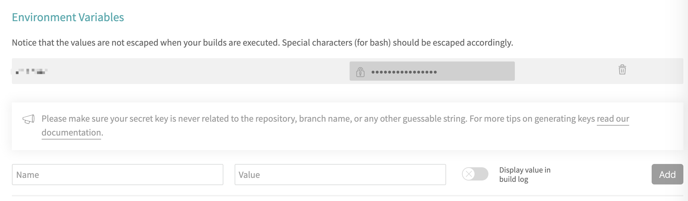
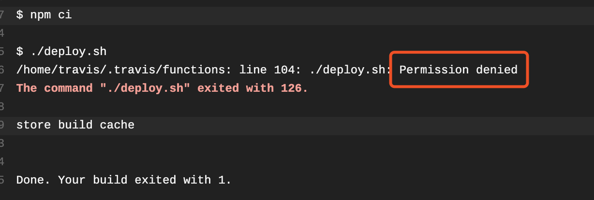

# Travis自动化部署VuePress到Github Pages
> 本文旨在帮助你用vuepress构建自己的博客或者文档，然后让它运行在免费的Github Pages上面，并且通过Travis这个集成工具来在你每次git push代码的时候自动部署。这样你每次push完等一会儿就可以在线上看到刚刚写好的文档啦！体验还是很不错的～😎

## 第一步：Vuepress
首先你需要参考[vuepress](https://vuepress.vuejs.org/)的官网文档，写一个vuepress的项目。注意，如果你选择官网文档快速上手部分写的第一种方式（全局安装体验）的话，那么你需要在你的新项目中写一个`package.json`，并执行以下几步：
```bash
# 将 VuePress 作为一个本地依赖安装
yarn add -D vuepress # 或者：npm install -D vuepress

# 新建一个 docs 文件夹
mkdir docs

# 新建一个 markdown 文件
echo '# Hello VuePress!' > docs/README.md

# 开始写作
npx vuepress dev docs
```
然后你的`package.json`里的`scripts`应该是这样的：
```json
{
  "scripts": {
    "docs:dev": "vuepress dev docs",
    "docs:build": "vuepress build docs"
  }
}
```
然后通过`npm run docs:dev`和`npm run docs:build`来在本地运行和构建。具体怎么在vuepress中配置markdown文档，导航菜单什么的，官方文档很详细了，甚至还可以自己开发布局，样式和交互。这里就不赘述了。我准备有空的时候用vuetify去写一个material的vuepress主题。到时候开源出来大家用。不过其实默认主题也还可以啦。

值得一提的是，默认没有favicon（就是浏览器窗口的那个小图标）和PWA支持，你需要在config.js里面配置`serviceWorker: true`来开启PWA，另外注意一下`base`字段的配置：
```js
module.exports = {
	title: '🌻社长的社畜',
	description: '前端技术博客',
	base: '/', // 设置站点根路径
	themeConfig: {
		sidebar: [
			'/',
		],
		sidebarDepth: 2,
	},
	head: [
		['link', { rel: 'icon', href: '/icon.ico' }],
		['link', { rel: 'apple-touch-icon', href: '/apple-touch-icon.png' }],
	],
	serviceWorker: true,
}
```
## 第二步：GitHub Pages
GitHub Pages可以让你用`https://<用户名>.github.io`这个域名来部署你刚刚在本地跑起来的vuepress文档。（当然也可以用）`https://<用户名>.github.io/<仓库名>`。这里跟上面配置里的`base`字段有关，第一种就用`'/'`就好了，第二种要用你的仓库名。如果你想将你的网站部署到 `https://foo.github.io/bar/`，那么`base`应该被设置成`"/bar/"`，它的值应当总是以斜杠开始，并以斜杠结束。

用第一种方式的话，你的github仓库名必须叫做：`<用户名>.github.io`，如果用第二种域名的话，就随意就好。先别急着push本地的代码上去。现在，在项目的根目录新建一个deploy.sh文件。
```bash
#!/usr/bin/env sh

# 确保脚本抛出遇到的错误
set -e

# 生成静态文件
npm run docs:build

# 进入生成的文件夹
cd docs/.vuepress/dist

# 如果是发布到自定义域名
# echo 'www.example.com' > CNAME

git init
git add -A
git commit -m 'deploy'

# 如果发布到 https://<USERNAME>.github.io，去掉下面这一行的注释
#git push -f https://${token}@github.com/<USERNAME>/<USERNAME>.github.io.git master

# 如果发布到 https://<USERNAME>.github.io/<REPO>，去掉下面这一行的注释
# git push -f https://${token}@github.com:<USERNAME>/<REPO>.git master:gh-pages

cd -
```
## 第三步：Travis
最后一步，我们要用[travis](https://travis-ci.com/)来部署我们的项目，简单来说，它会检测你的github仓库的变化，发现你push了新的代码上去，它就会自动执行刚才`deploy.sh`里的代码，然后部署你的项目上线。你可以注册登陆，并根据指示关联你的GitHub仓库，一切都默认就好，关联好了之后，由于travis没有权限操作GitHub，所以你需要去[GitHub设置](https://github.com/settings/tokens)里面生成一个你的Personal access tokens，这里会让你给你的token起一个名字，注意到上面`deploy.sh`里面的这一行了吗：
```bash
git push -f https://${token}@github.com/<USERNAME>/<USERNAME>.github.io.git master
```
这里面这个`${token}`的名字就是那个，然后新建token的时候下面的勾记得全都要勾上，默认都是没有选的。然后就会生成token，记得马上复制它，然后去到travis里面，应该可以看到你的github仓库名字，点进去，选择旁边的设置，然后下面有一个Environment Variables，配置好你刚才复制的token就可以了，注意name是你刚刚起的token名字，然后Add就可以了：


然后，你需要在命令行运行：
```bash
git update-index --add --chmod=+x deploy.sh
```
要不然你的travis后台会报错，（没权限）。`.travis.yml`配置:
```yml
language: node_js
node_js:
  - "8.15.1"

before_install:
  - chmod +x deploy.sh

cache:
  directories:
    - "node_modules"
  
branches:
  only:
  - dev

script:
  - ./deploy.sh

  
```



---
最后再push你的代码就可以了，travis就会自动执行部署了。这里注意要强制push，以为它编译之后的仓库跟你本地的不一样了，直接`git push`是不行的，每次强制push就好了：
```bash
git push origin master --force
```

等travis后台完成之后，就可以在你的域名上面看到你的文档咯！🎉