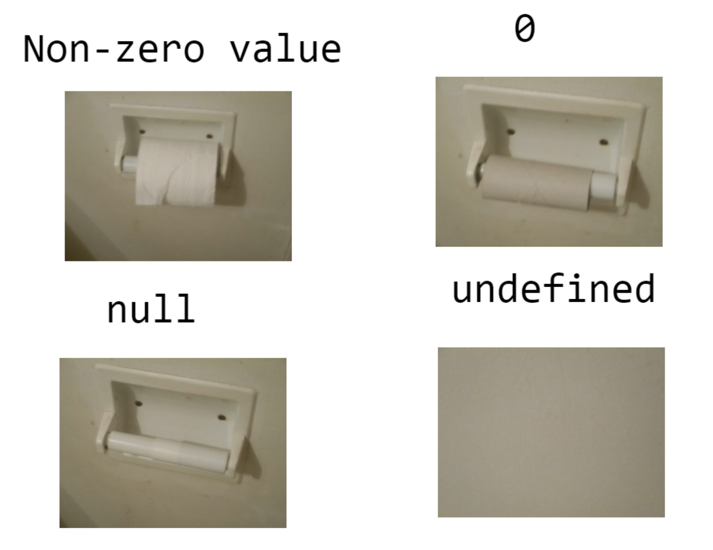
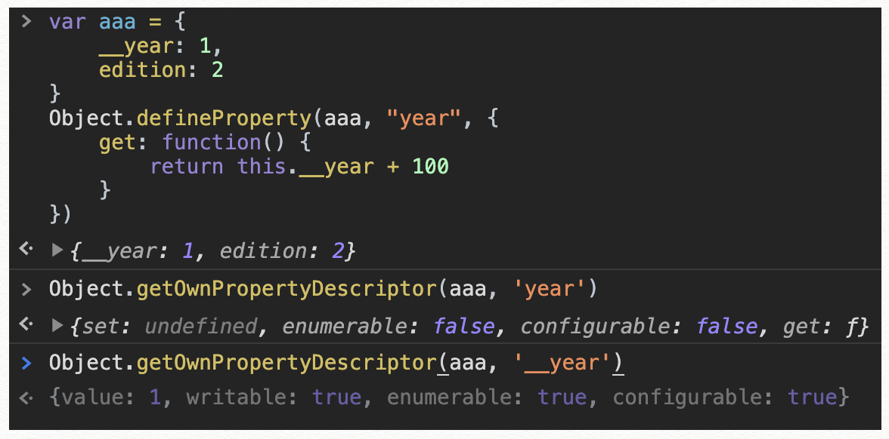
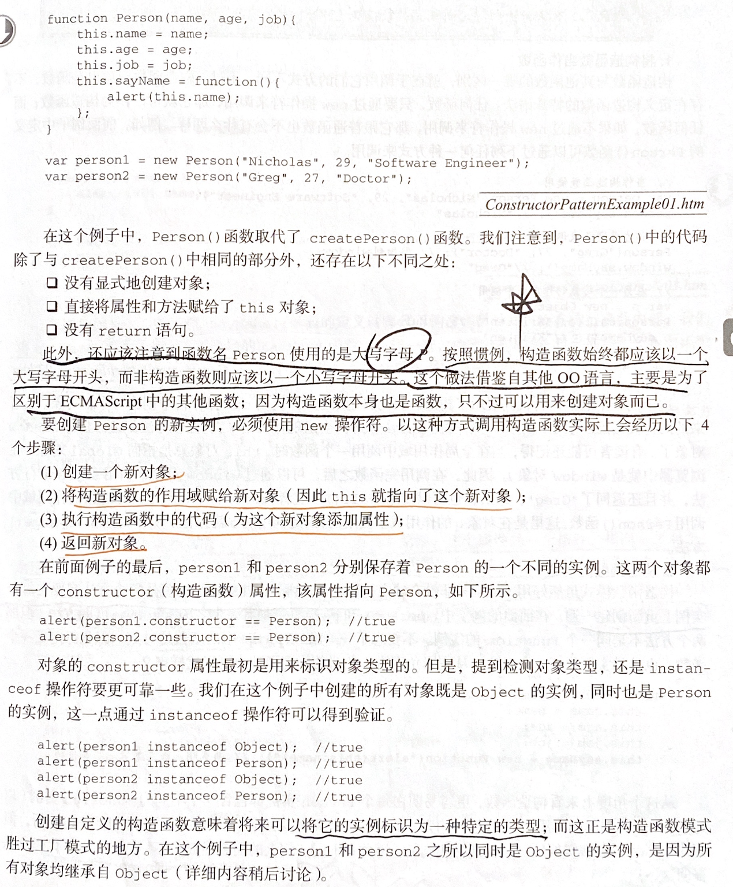
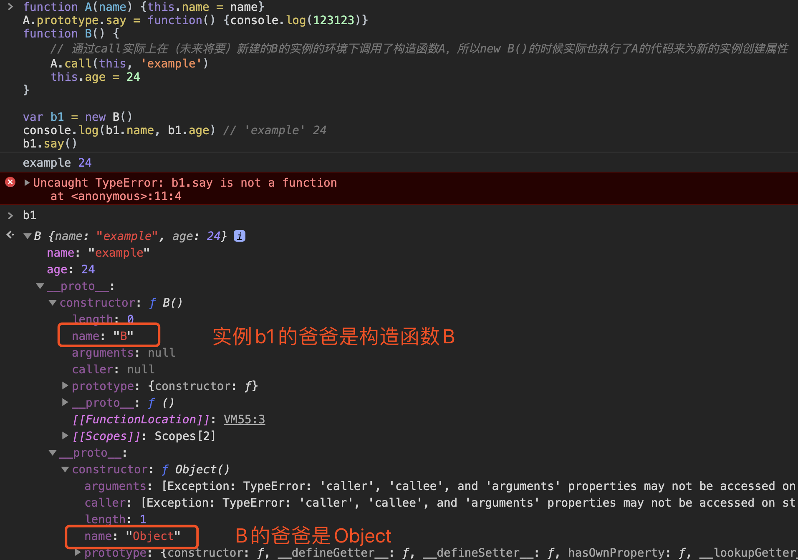
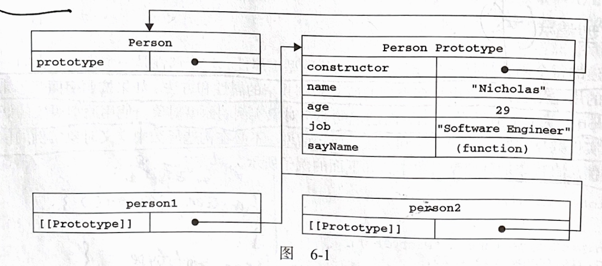

# 重学《JvaScript高级程序设计》-语法细节

## 数据类型
JavaScript原始数据类型(primitive)6个：Undefined, Null, Boolean, Number, String, Symbol。复杂数据类型1个：Object。

## 标识符
标识符是指变量、函数、属性的名字，或者函数的参数。
第一个字符必须是一个字母，下划线或一个美元符号。

## typeof
typeof是一个操作符而不是函数。对于typeof()这种使用方式，括号不是必须的。

对未初始化和未声明的变量执行typeof操作符都会返回"undefined"。因为未声明的变量的数据类型就是Undefined。用var等关键字声明了但未初始化值的变量，它的值是undefined，它的数据类型是Undefined。

typeof检测null值返回会返回"object"。**因为null值表示一个空对象指针**，undefined值派生自null值。按照规定，undefined == null要返回true。引入undefined是为了正式区分空对象指针与未经初始化的变量。没有必要显式的将一个变量声明为undefined，但是只要意在保存对象的变量还没有真正保存对象，就应该明确的让该变量保存null值。

undefined/null两者却在实现上完全不同：undefined是一个全局属性（在global上），而null是一个关键字。

typeof函数会返回“function”，准确的说，函数不是一种数据类型，而是对象。因为函数比较特殊，所以typeof区分了函数和其他对象。



## Boolean()
Boolean()会把任何类型的值转换成Boolean类型。与!!效果相同。
对于String：任何非空字符串（注意：''是空字符串，而'   '里面有空格，是非空字符串）会返回true，只有空字符串返回false；
对于Number：任何非零数字值（包括无穷大）返回true，0和NaN返回false；
对于Object：任何对象返回true（Boolean({}) // true），只有null返回false。
if语句会自动根据以上规则执行Boolean转换。

## 浮点数运算
由于保存浮点数需要的内存空间是保存整数的两倍，因此JS会不失时机地将浮点数转换为整数值。如果浮点数表示的值本身就是一个整数，比如10.0，那么会被转换成整数10。

浮点数的最高精度是17位小数，0.1 + 0.2不等于0.3的问题。因为计算机是转换成二进制来运算的（计算方法是：对于整数，除2取余；对于小数，乘2取整），0.1和0.2在有限的精度内转换成二进制都是不精确的（无限循环），所以在有限的精度内二进制只能取近似值，进而无法得到准确的0.3，但是0.05和0.25就可以准确的用二进制表示，可以得到0.3。但是无法精确表示的0.1+0.4却可以得到可以用二进制准确表示的0.5，这是因为在有限精度的二进制世界里，与0.1+0.4得到的那个无限位的二进制数最接近的二进制数，转换成十进制数刚好就是0.5。

详细原理请看：《IEEE 754》

## NaN
任何数值除以非数值会返回NaN，NaN与任何值都不相等，包括NaN本身。isNaN()尝试将接收到值转换为数值，不能转换为数值，返回false。比如：
```js
isNaN('') // flase
isNaN('a') // true
isNaN(false) // flase
```
isNaN函数其实等同于回答了这样一个问题：被测试的值在被强制转换成数值时会不会返回IEEE-754 中所谓的“不是数值（not a number）”。
和全局函数 isNaN() 相比，Number.isNaN() 不会自行将参数转换成数字，只有在参数是值为 NaN 的数字时，才会返回 true。

## Number(), parseInt(), parseFloat() 
数值转换函数：Number(), parseInt(), parseFloat()
```js
Number(null) // 0
Number('') // 0
Number(undefined) // NaN
Number("123") // 123
Number("123a") // NaN

parseInt()只会解析数字字符，直到遇到一个非数字字符为止。
parseInt("123a") // 123
parseInt("22.5") // 22（因为小数点不是有效的数字字符）
parseInt("") // NaN
parseInt()第二个参数是几进制的基数，2、8、10、16。

parseFloat()可以识别第一个小数点。
parseFloat("22.5") // 22.5
```

## String
JavaScript中的字符串是不可变的，要改变某个变量保存的字符串，首先要销毁原来的字符串，然后再用另一个包含新值的字符串填充该变量。

## +
只有null和undefined没有toString方法，但是可以用String()方法返回任何数据类型的值转换为字符串，即调用他们的toString方法，而这两个值直接返回"null"和"undefined"。要把某个值转换为字符串，可以使用+号把它和一个字符串""加在一起。

一元加和减运算符除了用于基本的算数运算，还可以用来转换数据类型，跟Number()效果一样。

JS中的所有数值都是64位格式存储，但是会转换成32位整数操作。第32位是符号位，0为正，1为负。

## ～ & ｜ ^
按位非~，执行按位非的结果是返回数值的反码（32位二进制数，每一位反过来）。非操作的本质，操作数的负值减1。
```js
var a = 25
var b = ~a // -26
var c = -a - 1 // -26 虽然结果一样，但是按非操作直接操作底层，速度更快。
```
* 按位与&，对应位置都是1才返回1。
* 按位或|，对应位置有一个1就返回1。
* 按位异或^，对应位置只有一个1才返回1。

## &&
&&逻辑与（&&）操作是短路操作，第一个操作数转换成布尔值如果是false，那么返回第一个。如果第一个操作数是true，则返回第二个操作数。
解释一下第二句话，如果&&两边都是布尔值，那么第一个为true，最终的结果取决于第二个。同理，如果第一个操作数是对象（其实相当于第一个是true），则返回第二个操作数。eg：
```js
var a = {a: 1} && {b: 2} // {b: 2} 第一个操作数是true，返回第二个。
var a = 1 && 2 // 2 第一个操作数是true，返回第二个。
var a = false && 2 // false 第一个操作数是false，返回第一个。
var a = '' && 2 // '' 第一个''是空字符串，是false，返回第一个。
var a = '  ' && 2 // 2 第一个'  '有空格的字符串，属于非空字符串，是true，所以返回第二个。
```

## ||
逻辑或（||）也是短路操作，跟上文类似，||是第一个操作数转换成布尔值如果是true，那么返回第一个。如果第一个操作数是false，则返回第二个。

## 算数运算符
加法运算：如果一个是字符串，则将另一个转换成字符串，拼接起来，常犯的错误：
```js
var a = 1
var b = 2
var c = 'the sum of 1 and 2 is ' + a + b // c: 'the sum of 1 and 2 is 12'
```

如果第一个不是字符串，加法运算则不会拼接字符串，对第二个运行Number()转换成数字，如果结果是NaN，那么最终的结果也就是NaN。

## 大于小于比较
如果一个是数字，另一个是字符串，则先将其转换成数值再比较，如果无法转换成数值，即转换结果是NaN，则返回false，根据约定，任何数跟NaN用< >比较大小结果都是false。

## if语句
if (condition) {}，其中condition表达式的结果不一定是布尔值，但是会自动调用Boolean()。

## with
with可能带来性能问题，少用。它的作用主要是简化多次编写同一个对象的工作，比如：
```js
var a = obj.a
var b = obj.b
var c = obj.c
// with
with(obj) {
	var a = a
	var b = b
	var c = c
}
```
## arguments
JS函数的一个重要特点：命名的参数只提供便利，但不是必需的。参数名字只是提供便利而已，完全可以用arguments。

所以参数传递的都是值，不可能通过引用传递参数。

未指定返回值的函数返回undefined。

## 按值传递
JS中所以函数的参数都是按值传递的。被传递的值会被赋值给一个局部变量（即命名参数，换句话说，就是arguments对象中的一个元素）。按值传递说明里面的局部变量被赋值为传入值，互不影响。但是在向参数传递引用类型的值时，对它的操作会影响到外部。但是它也是按值传递的，只不过传递的是一个引用，即使在函数内部修改了参数的值，但原始的引用并不会改变。但会引起此副作用。

## instantsof
所有引用类型的值都是Object的实例。检测是何种类型的对象：instanceof。

## 函数
函数是对象，函数名实际上是一个指向函数对象的指针。这也是没有重载的原因，第二个同名函数会覆盖第一个，这其实相当于把一个变量重新赋值。

函数声明和函数表达式的区别是，函数声明会被解析器率先解析，而函数表达式必须等到解析器执行到它，才会真正被解释执行。

函数是对象，所以函数也有属性和方法，每个函数都包含两个属性：length和prototype。length表示函数希望接收的命名参数的个数。对于JS中的引用类型，prototype是保存它们所有实例方法的真正所在。

## this
this引用的是函数执行的环境对象。

## 基本包装类型
JS提供了3个特殊的引用类型：Boolean, String, Number。这三个对应的基本类型不是对象，从逻辑上应该没有方法，但是却有substring()等方法。原因是在创建基本类型的值的时候，后台会创建一个对应的基本包装类型的对象，从而实现了一些方法。创建过程：
1. 创建String类型的一个实例。
2. 在实例上调用指定的方法。
3. 销毁这个实例。
```js
var s1 = 'some text'
var s2 = s1.substring(2)
// 相当于：
var s1 = new String('some text')
var s2 = s1.substring(2)
s1 = null
// 所以我们可以理解这段代码了：var s1 = 'some text'
s1.color = 'red' // 临时创建了一个String包装对象s1，给这个对象增加了一个color属性，这行代码执行完之后，就被销毁了
console.log(s1.color) // undefined，然而，这里读取s1的color属性时，又创建了一个String包装对象，但是它没有color属性
```
Object构造函数会根据传入值的类型创建相应的基本包装类型的实例：
var obj = new Object('some text')
obj instanceof String // true

## 进制转换方法
```js
var num = 10
num.toString(2) // 转换成二进制"1010"
num.toString(16) // 转换成十六进制"a"
```

## Object.defineProperty()
对象有两种属性：
* 数据属性：四个特性，（[[Configurable]], [[Enumerable]], [[Writeable]], [[Value]]），对象值实际存储的位置就是[[Value]]。
* 访问器属性：四个特性，（[[Configurable]], [[Enumerable]], [[Get]], [[Set]]）
Object.getOwnPropertyDescriptor(obj, 'name')获取属性描述符。



## 工厂模式
工厂模式的问题是无法识别对象的具体类型。

## 构造函数模式（new操作发生了什么？）
构造函数模式的问题是每个方法都要在每个实例上重新创建一遍。不同实例上的同名函数是不相等的。

## Object.keys()
Object.keys() 方法会返回一个由一个给定对象的自身可枚举属性组成的数组，数组中属性名的排列顺序和使用 for…in 循环遍历该对象时返回的顺序一致 （两者的主要区别是 一个 for-in 循环还会枚举其原型链上的属性）。

## new


## 继承
原型继承：令一个对象(a)的原型等于另一个对象(b)的实例（a.prototype = new b();），这样这个对象(a)的原型就成为了另一个对象(b)的实例，而实例里包含了指向其原型对象(b.prototype)的指针，那么，这个对象(a)就拥有了指向另一个对象(b)的指针。这就是原型链（继承），此时，当访问a中没有的属性或方法时，便会顺着原型链找到父对象(b)里的属性或方法。

所以的引用类型默认都继承了Object，它们都会包含一个内部指针，指向Object.prototype。

原型链继承的两个问题：

同原型模式存在的问题一样，对于引用类型，包含引用类型值的原型属性会被所有实例共享，而这也是为什么要在构造函数中，而不是在原型中定义属性的原因。在通过原型来实现继承时，原型实际上会变成另一个类型的实例，于是，原先的实例属性就变成了现在的原型属性了。
```js
function A() {	this.nums = [1, 2, 3]}
function B() {}
// B继承了A，B.prototype成了构造函数A的一个实例，因此B.prototype拥有了一个它自己的nums属性--就跟专门创建了一个B.prototype.nums属性一样，它是构造函数B的实例共享的。
B.prototype = new A()

var b1 = new B()
b1.nums.push(4)
console.log(b1.nums) // 1,2,3,4

var b2 = new B()
console.log(b2.nums) // 1,2,3,4
```
原型链的第二个问题，在创建子类型的实例时，不能向超类型的构造函数（不影响所有实例的情况下）中传递参数。

```js
// 借用构造函数实现继承：
function A(name) {	this.name = name}
function B() {
	// 通过call实际上在（未来将要）新建的B的实例的环境下调用了构造函数A，所以new B()的时候实际也执行了A的代码来为新的实例创建属性。	A.call(this, 'example')
	this.age = 24
}

var b1 = new B()
console.log(b1.name, b1.age) // 'example' 24
```
构造函数继承也存在构造函数模式的问题，函数无法复用，且在超类型的原型中定义的方法对于子类型是不可见的。
也就是说原型链里并不会找到A，找say()方法的过程应该是：`b1 => B.prototype => Object.prototype`


记住这张图中的prototype, constructor, __proto__(即[[prototype]])的关系：实例跟构造函数没有直接的联系。


## 组合继承
用构造函数继承实例属性（也就是说这个属性是实例自己的，每个实例创建一个），用原型链继承原型属性和方法（它俩是实例共享的）。组合继承的问题：会调用两次超类型的构造函数。
```js
function A(name) {	this.name = name
	this.nums = [1, 2, 3]}
A.prototype.sayName = function () {
	console.log(this.name)
}
function B(name, age) {	// 继承实例属性，并且传递参数，第二次调用A()，在新对象上创建了两个实例属性(name, nums)，屏蔽了原型中(B.prototype)的两个同名属性，它们不是共享的。
	A.call(this, name)
	this.age = age}

// 继承方法，第一次调用A()，B的原型中(B.prototype)得到了两个属性(name, nums)，而且它们是共享的。
B.prototype = new A()
// 重写原型会失去constructor，这里重新设置为构造函数B
B.prototype.constructor = B
B.prototype.sayAge = function() {
	console.log(this.age)
}

var b1 = new B('b1', 1)
b1.nums.push(4)
console.log(b1.nums) // 1,2,3,4
b1.sayAge() // 1
b1.sayName() // 'b1'

var b1 = new B('b2', 2)
console.log(b1.nums) // 1,2,3
b1.sayAge() // 2
b1.sayName() // 'b2'
```

## 原型式继承
Object.create()由此演变而来，可以以一个对象为原型来创建一个新对象。本质上也是利用prototype实现继承。核心代码如下：
```js
function object(o) {
  function F() {}
	F.prototype = o
  return new F()
} 
object()对传入其中的对象执行了一次浅拷贝。
```
