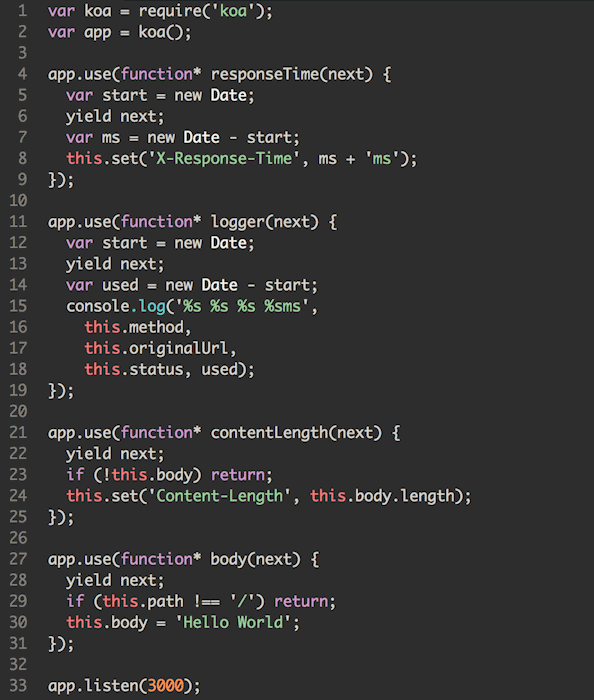

# Node.js部分知识点概览

## node环境变量
__filename //当前文件位置

__dirname //当前文件所在目录位置

process进程对象：
platform,
cpuUsage,
memoryUsage.

env //运行环境变量

argv //启动node的命令行

## node观察者：
```js
// lib.js
const EventEmitter = require('events').EventEmitter

class A extends EventEmitter {
  constructor() {
    super()
    setInterval(() => {
	// 抛出事件
      this.emit('new', Math.random() * 100)
    }, 1000)
  }
}
const a = new A

module.exports = a

// index.js
const a = require('./lib')
// 监听事件
a.addListener('new', (res) => {
  console.log('new', res)
})
```
观察者模式适合不知道被通知者的存在，以及没有人听程序还能继续下去就算没有接收也可以继续下去的情况，比如说上新之后给用户群发通知。多模块引用，扩展性强。

## node非阻塞I/O
I/O：input/output

阻塞I/O和非阻塞I/O的区别就是系统接收输入到输出的期间，还能不能接收其他的输入，阻塞的I/O就是不可以的。

例子：排队打饭

对于点菜人员（单一对象思考阻塞问题）：

排队打饭----阻塞I/O

餐厅点菜----非阻塞I/O

glob：非阻塞的例子
```js
console.time('glob')
glob(__dirname + '/**/*', (err, res) => {
  console.log(res)
})
console.timeEnd('glob')
// glob: 2ms
```

## 洋葱模型
express的洋葱模型存在异步缺陷，koa用promise，async，await解决了此问题。
引用两张[Egg.js](https://eggjs.org/zh-cn/intro/egg-and-koa.html)官网的图片：




## RPC调用
和ajax的不同：

* ajax是客户端和服务器，RPC是服务器和另一台服务器。（更快）
* 不一定使用DNS作为寻址服务。
* 应用层协议一般不使用HTTP。
* 基于TCP或UDP。

## TCP通信方式：
* 单工通信
* 半双工通信（http1.1）
* 全双工通信（难度成本大,http2）

RPC调用是服务器跟服务器的通信，使用二进制编码，更小的数据包体积，更快的编码速率。

```js
// protocol buffers:

// npm i protocol buffers
const buffer1 = Buffer.from('a')
const buffer2 = Buffer.from([1, 2, 3])
const buffer3 = Buffer.alloc(20) 

console.log(buffer1)
console.log(buffer2)
console.log(buffer3)

buffer2.writeInt8(11, 1)
console.log(buffer2)

const fs = require('fs')
const protobuf = require('protocol-buffers')
const schema = protobuf(fs.readFileSync(__dirname + '/test.proto', 'utf-8'))
const buffer = schema.Column.encode({
  id: 1,
  name: 'a',
  price: 10
})
console.log(schema.Column.decode(buffer))
```

## net：多路复用的RPC通道
半双工通信
```js
//server.js
const net = require('net')

const server = net.createServer((socket) => {
  socket.on('data', function(buffer) {
    const id = buffer.readInt32BE()
    console.log(id)
    setTimeout(() => {
      socket.write(Buffer.from(data[id]))
    }, 1000)
  })
})
server.listen(4000)

const data = {
  1: 'a',
  2: 'b',
  3: 'c'
}

//client.js
const net = require('net')

const socket = new net.Socket({})
socket.connect({
  host: '127.0.0.1',
  port: 4000
})

const data = ['1', '2', '3']

let buffer = Buffer.alloc(4)
buffer.writeInt32BE(data[Math.floor(Math.random() * data.length)])
socket.write(buffer)
socket.on('data', (buffer) => {
  console.log(buffer.toString())
  buffer = Buffer.alloc(4)
  buffer.writeInt32BE(data[Math.floor(Math.random() * data.length)])
  socket.write(buffer)
})
```

## 全双工通信
客户端跟服务端都可以随时互相发送信息，怎么来分清楚一个返回包对应的是哪个请求包呢？
答案就是用一个seq来标记请求包。
```js
//server.js
const net = require('net')

const server = net.createServer((socket) => {
  socket.on('data', function(buffer) {
    const seqBuffer = buffer.slice(0, 2)
    const id = buffer.readInt32BE(2)
    // 返回的包是随机时间的，不像上一个例子是等待返回才发下一个包
    setTimeout(() => {
      const buffer = Buffer.concat([
        seqBuffer,
        Buffer.from(data[id])
      ])
      socket.write(buffer)
    }, Math.random() * 3000 + 1000)
  })
})
server.listen(4000)

const data = {
  1: '111',
  2: '222',
  3: '333',
  4: '444',
  5: '555',
  6: '666'
}

//client.js
const net = require('net')

const socket = new net.Socket({})
socket.connect({
  host: '127.0.0.1',
  port: 4000
})

const data = ['1', '2', '3', '4', '5', '6']

socket.on('data', (buffer) => {
  const seqBuffer = buffer.slice(0, 2)
  const titleBuffer = buffer.slice(2)
  console.log(seqBuffer.readInt16BE(), titleBuffer.toString())
  console.log('====================')
})

let seq = 0
function encode() {
  let buffer = Buffer.alloc(6)
  let id = data[Math.floor(Math.random() * data.length)]
  buffer.writeInt16BE(seq)
  buffer.writeInt32BE(id, 2)
  console.log(seq, id)
  seq++
  return buffer
}
// 不用等待返回，不断的发请求。通过seq来找到对应的返回包。
setInterval(() => {
  socket.write(encode())
}, 50)
```

## 粘包
全双工通信的问题，一次性发送多个请求，比如：
```js
for (let i = 0; i < 100; i++) {
  socket.write(encode())
}
```
TCP协议会把它们合并为一个大包。称之为粘包。要在server里面进行粘包切分。把这些请求还原成原始的包。


## 用ES6实现一个简单的模版引擎
```js
vm.runInNewContext(）
const user = {
  name: 'a'
}

const vm = require('vm')
console.log(vm.runInNewContext('`<h2>${user.name}</h2>`', { user }))
// <h2>a</h2>
```
把es6当ejs模版引擎用：把模版字符串放进沙箱里面，传数据进去重新编译运行。

## XSS过滤和include子模版
```js
const vm = require('vm')
const templateMap = {
  templateA: '`<h1>${include("templateB", {name: "chenkan"})}<h2>${data.age}</h2></h1>`',
  templateB: '`<p>${data.name}</p>`'
}
//include子模版
const context = {
  include: function (name, data) {
    return templateMap[name](data)
  },
//XSS过滤
  _: function() {
    if (!markup) return ''
    return String(markup)
      .replace(/&/g, '&amp;')
      .replace(/</g, '&lt;')
      .replace(/>/g, '&gt;')
      .replace(/'/g, '&#39;')
      .replace(/"/g, '&quot;')
  }
}
Object.keys(templateMap).forEach((key) => {
  const temp = templateMap[key]
  templateMap[key] = vm.runInNewContext(`
    (function (data) {
	//with传参数
      with (data) {
        return ${temp}
      }
    })
  `, context)
})
console.log(templateMap['templateA']({age: 24}))
// <h1><p>chenkan</p><h2>24</h2></h1>
```

## EasySock（rpc通信）
[EasySock（rpc通信）](https://www.npmjs.com/package/easy_sock)
```js
const easySock = new EasySock({ 
    ip: '127.0.0.1',
    port: 4000,
    timeout: 500,
    // 全双工通信
    keepAlive: true
})
```

## HTTP性能分析
### ab压测

ab -c200 -n1500 http://127.0.0.1:3000/download/

-c200表示同时有200个请求，-n1500表示请求1500次。（ps: -t15表示请求15s）

## Nodejs调试
### node profile
1. 先执行：
node --prof index.js
启动。
2. 然后进行压测，生成一个log文件，然后执行：
node --prof-process isolate-0x103800000-v8.log > profile.txt
得到profile.txt，包含了性能结果。
主要拉到最后看[Bottom up (heavy) profile]

### chrome devtools
1. node --inspect-brk index.js
2. chrome地址栏输入chrome://inspect
3. profile start监听
4. ab压测
5. chrome会生成profiler可视化分析报告

## cluster
```js
const cluster = require('cluster')
const os = require('os')

if (cluster.isMaster) {
  for (let i = 0; i < os.cpus().length / 2; i++) {
    cluster.fork()
  }
} else {
  require('./index.js')
}
```
cluster可以fork多个子进程，充分利用多核CPU。但是不稳定。

nodejs监听内存：process.memoryUsage().rss

## serverless
屏蔽服务器细节，直接写函数就可以完成服务端功能的开发，使用者不用关注运维和服务器的细节。跟vue和react屏蔽了dom操作的细节一样。less就是屏蔽细节（把多个业务复用的东西下沉），让业务开发更容易，更稳定。


