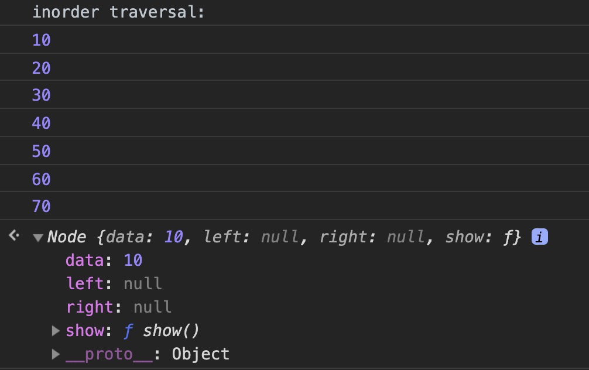

# 二叉查找树的JavaScript实现

## 定义
二叉查找树（Binary Search Tree）是指一棵空树或者具有下列性质的二叉树：
* 若任意节点的左子树不空，则左子树上所有节点的值均小于它的根节点的值；
* 若任意节点的右子树不空，则右子树上所有节点的值均大于它的根节点的值；
* 任意节点的左、右子树也分别为二叉查找树；
* 没有键值相等的节点。

## JavaScript实现
```js
function Node(data, left, right) {
	this.data = data;
	this.left = left;
	this.right = right;
	this.show = show;
}

function show() {
	return this.data;
}

function BST() {
	this.root = null;
	this.insert = insert;
	this.inOrder = inOrder;      //中序遍历    
	this.preOrder = preOrder;    //前序遍历
	this.postOrder = postOrder;  //后序遍历
	this.getMax = getMax;        //查找最小值
	this.getMin = getMin;        //查找最大值
	this.find = find;            //查找给定的值
}

function insert(data) {
	let n = new Node(data, null, null);
	if (this.root === null) {
		this.root = n;
	} else {
		let current = this.root;
		let parent;
		while (true) {
			parent = current;
			if (data < current.data) {
				current = current.left;
				if (current === null) {
					parent.left = n;
					break;
				}
			} else {
				current = current.right;
				if (current === null) {
					parent.right = n;
					break;
				}
			}
		}
	}
}

function inOrder(node) {
	if (node !== null) {
		inOrder(node.left);
		console.log(node.show());
		inOrder(node.right);
	}
}

function preOrder(node) {
	if (node !== null) {
		console.log(node.show());
		preOrder(node.left);
		preOrder(node.right);
	}
}

function postOrder(node) {
	if (node !== null) {
		postOrder(node.left);
		postOrder(node.right);
		console.log(node.show());
	}
}

function getMax() {
	let current = this.root;
	while (current.right !== null) {
		current = current.right;
	}
	return current.data;
}

function getMin() {
	let current = this.root;
	while (current.left !== null) {
		current = current.left;
	}
	return current.data;
}

function find(data) {
	let current = this.root;
	while (current !== null) {
		if (current.data === data) {
			return current;
		} else if (current.data < data) {
			current = current.right;
		} else {
			current = current.left;
		}
	}
	return null;
}

//Test:
let nums = new BST();
nums.insert(40);
nums.insert(20);
nums.insert(60);
nums.insert(10);
nums.insert(50);
nums.insert(70);
nums.insert(30);
console.log('inorder traversal: ');
nums.inOrder(nums.root);
nums.find(10);
```
结果如下图所示：

