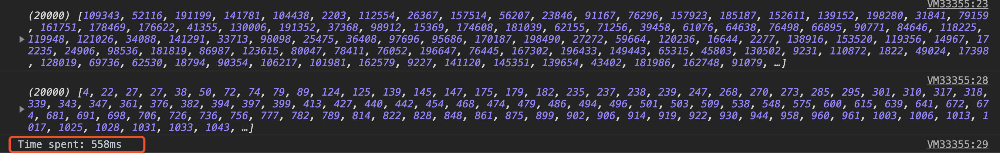
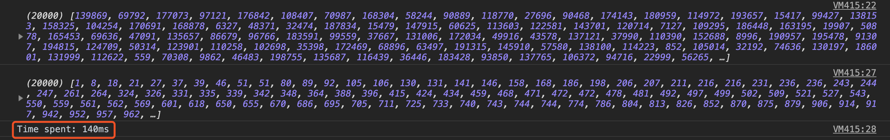
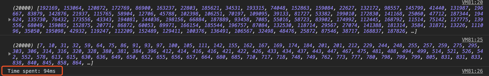
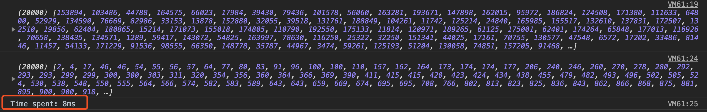
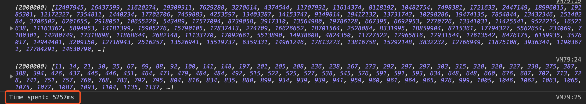
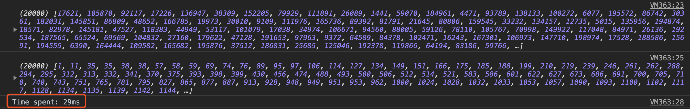
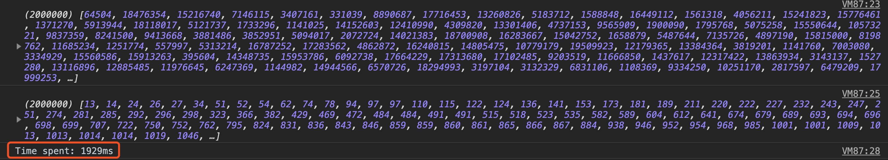
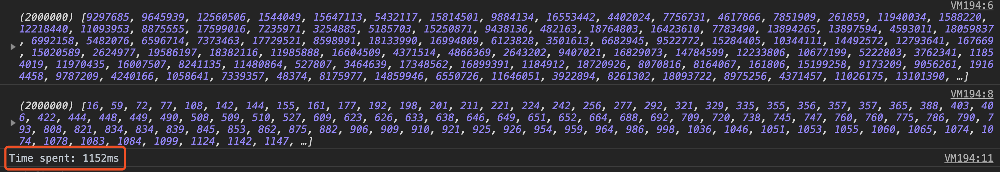

# 几种排序算法的JavaScript实现

## 算法稳定性
排序前后两个相等的数相对位置不变，则算法稳定。
* 稳定的排序算法：冒泡排序，插入排序。
* 不稳定的排序算法：选择排序，希尔排序，快速排序。

## 冒泡排序
```javascript
// 给个参考数组方便看逻辑：
// arr = [3, 1, 5, 4, 2]
function bubbleSort(arr) {
	for (let i = arr.length - 1; i > 1; i--) {
	// 每一次j循环找出中找出最大的那一个数冒泡放在末尾
		for (let j = 0; j < i; j++) {
			if (arr[j] > arr[j + 1]) {
				[arr[j], arr[j + 1]] = [arr[j + 1], arr[j]]
			}
		}
	}
}

let nums = []
for (let i = 0; i < 20000; i++) {
  nums[i] = Math.floor(Math.random() * 200000 + 1)
}

console.log(nums)
let start = new Date().getTime()
bubbleSort(nums)
let end = new Date().getTime()
let elapsed = end - start
console.log(nums)
console.log(`Time spent: ${elapsed}ms`)
```
两万个数：

两百万个数：
电脑死机了...

## 选择排序
```javascript
// 给个参考数组方便看逻辑：
// arr = [3, 1, 5, 4, 2]
function selectSort(arr) {
	let minIndex = 0
	len = arr.length
	for (let i = 0; i < arr.length - 1; i++) {
		minIndex = i
		// j循环完成后，找到了最小的那个数
		for (let j = i + 1; j < arr.length; j++) {
			if (arr[j] < arr[minIndex]) {
				minIndex = j
			}
		}
		// 用这个数和i交换位置
		[arr[i], arr[minIndex]] = [arr[minIndex], arr[i]]
	}
}

let nums = []
for (let i = 0; i < 20000; i++) {
  nums[i] = Math.floor(Math.random() * 200000 + 1)
}

console.log(nums)
let start = new Date().getTime()
selectSort(nums)
let end = new Date().getTime()
let elapsed = end - start
console.log(nums)
console.log(`Time spent: ${elapsed}ms`)
```
两万个数：


## 插入排序
```javascript
// 给个参考数组方便看逻辑：
// arr = [3, 1, 5, 4, 2]
function insertSort(arr) {
	let current
	let j
	// 每一个i循环都会找到当前元素应该在的位置
	// 每次循环，i前面的位置都是已经排序好了的
	for (let i = 1; i < arr.length; i++) {
		current = arr[i]
		j = i
		// 从当前元素开始往前遍历，如果比当前元素大，就往后挪一位占位
		// 循环结束后，当前元素会被插入到比他大的元素前面一位
		while (j > 0 && arr[j - 1] >= current) {
			arr[j] = arr[j - 1];
			j--
		}
		arr[j] = current
	}
}

let nums = []
for (let i = 0; i < 20000; i++) {
	nums[i] = Math.floor(Math.random() * 200000 + 1)
}

console.log(nums)
let start = new Date().getTime()
insertSort(nums)
let end = new Date().getTime()
let elapsed = end - start
console.log(nums)
console.log(`Time spent: ${elapsed}ms`)
```
两万个数：


## 希尔排序
```javascript
function shellSort(arr) {
	let interval = [701, 301, 132, 57, 23, 10, 4, 1]
	for (let k = 0; k < interval.length; k++) {
		for (let i = interval[k]; i < arr.length; i++) {
			let current = arr[i]
			for (let j = i; j >= interval[k] && arr[j - interval[k]] > current; j -= interval[k]) {
				arr[j] = arr[j - interval[k]]
			}
			arr[j] = current
		}
	}
}

let nums = [];
for (let i = 0; i < 20000; i++) {
	nums[i] = Math.floor(Math.random() * 200000 + 1)
}

console.log(nums)
let start = new Date().getTime()
shellSort(nums)
let end = new Date().getTime()
let elapsed = end - start
console.log(nums)
console.log(`Time spent: ${elapsed}ms`)
```
两万个数：

两百万个数：


## 快速排序
```javascript
function quickSort(arr) {
	if (arr.length === 0) {
		return []
	}
	let left = []
	let right = []
	let pivot = arr[0]
	for (let i = 1; i < arr.length; i++) {
		if (arr[i] < pivot) {
			left.push(arr[i])
		} else {
			right.push(arr[i])
		}
	}
	return quickSort(left).concat(pivot, quickSort(right))
}

let nums = []
for (let i = 0; i < 20000; i++) {
	nums[i] = Math.floor(Math.random() * 200000 + 1)
}

console.log(nums)
let start = new Date().getTime()
console.log(quickSort(nums))
let end = new Date().getTime()
let elapsed = end - start
console.log(`Time spent: ${elapsed}ms`)
```

2,000,000个数：


## Array.sort()

Array.sort()各个浏览器的实现算法不同，Chrome的实现是`<=10`的时候是插入排序，大于10的时候是快速排序。
```js
let nums = [];
for (let i = 0; i < 2000000; i++) {
	nums[i] = Math.floor(Math.random() * 20000000 + 1)
}

console.log(nums)
let start = new Date().getTime()
// 高阶函数sort，默认按字符的Unicode排序
// 如果传入一个回调函数，数组会按照调用该函数的返回值排序。即a和b是两个将要被比较的元素：
// 如果结果小于0，那么a会被排列到b之前，即升序排列
console.log(nums.sort((a, b) => a - b))
let end = new Date().getTime()
let elapsed = end - start
console.log(`Time spent: ${elapsed}ms`)
```
二百万个数：
