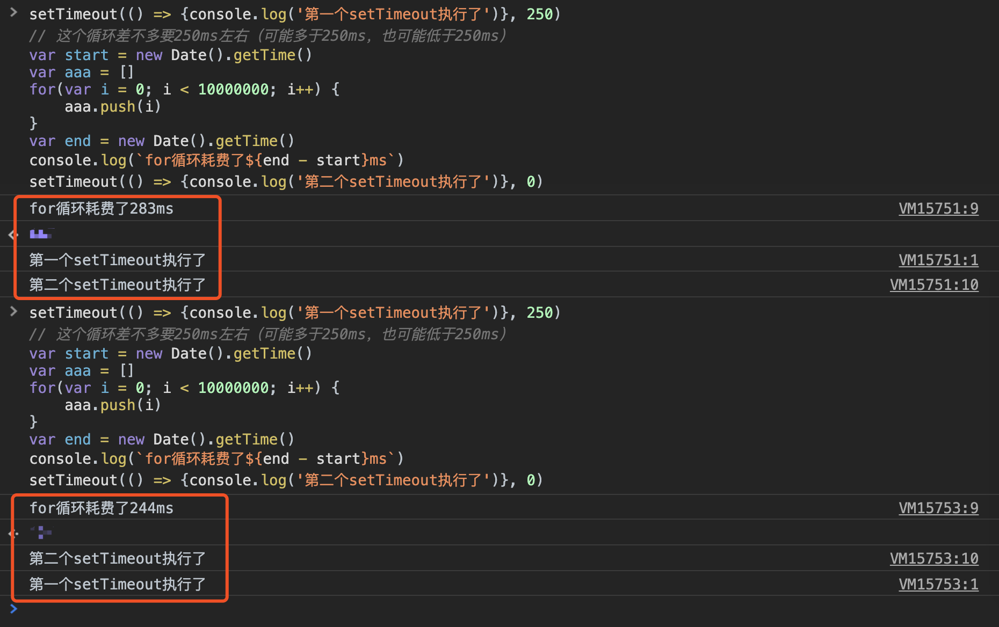

# Node的异步I/O

## Node本身是多线程的
Node的异步I/O实际上也是利用线程池实现的。我们经常说Node是单线程的，但是实际上只是说最上层的JavaScript是在单线程中执行的。Node底层还是通过线程池来实现异步I/O的。只有js是单线程的，Node本身是多线程的。异步实现：Windows: IOCP, *nix: 多线程。Node通过libuv封装了这两种实现。

## Node自上而下的结构
JavaScript（运行在V8上，V8集成到了Node里面）↓

Nodejs核心模块↓

C++内建模块↓

libuv系统调用（中间层，平台判断，兼容处理Windows和*nix平台）。

## 请求对象
从JavaScript层面发起的异步调用开始，会创建一个**请求对象**，它保存了所有的请求状态，参数，回调。请求对象会被推入线程池等待执行。Node异步调用过程：

JavaScript ↓ 

调用Node核心模块 ↓ 

调用C++模块 ↓ 

libuv封装一个请求对象 ↓ 

不同的平台调用不同的系统API ↓ 

送入线程池等待执行 ↓ 

js立即返回并继续执行。

## 线程池
线程可用 ↓ 

执行请求对象的I/O操作 ↓ 

执行完成后将结果放入请求对象中 ↓ 

通知系统调用完成了（观察者通过调用系统内核的方法来检查线程池中是否有执行完的请求）。

## Node事件循环
在进程启动时，Node会创建一个类似于`while(true)`的循环，每执行一次循环就是一个`Tick`。每个Tick就是查看有没有事件待处理（通过观察者来查看，观察者可以有很多个：文件I/O观察者，网络I/O观察者，事件循环去观察者里面取出事件），如果有就从观察者那里取出请求对象，取出回调函数执行。然后进入下一个Tick，最后没有事件了，就退出进程。概括来说就是：

创建主循环 ↓ 

每个Tick从观察者里取请求对象（观察者通过调用系统内核方法来检查线程池中是否有执行完的请求）↓ 

取出回调函数执行 ↓ 

下一个Tick。
#### setTimeout()、progress.nextTick()、setImmediate()
`setTimeout()`的原理差不多，只是不需要I/O线程池的参与。调用setTimeout()创建的定时器会被插入到**定时器观察者**内部的一个红黑树中，每次Tick执行的时候，会从该红黑树中迭代取出定时器对象，检查是否查过定时时间，如果超过，就形成一个事件，它的回调函数将立即执行。

`progress.nextTick()`: 效果和setTimeout(fn, 0)差不多，但是性能更好一点。并且优先级高于`setImmediate()`。

## 顺便看看浏览器中的事件循环
* 所有同步任务都在主线程上执行，形成一个执行栈（execution context stack）。
* 主线程之外，还存在一个"任务队列"（task queue）。只要异步任务有了运行结果，就在"任务队列"之中放置一个事件。"任务队列"中的事件，除了IO设备的事件以外，还包括一些用户产生的事件（比如鼠标点击、页面滚动等等）。只要指定过**回调函数**，这些事件发生时就会进入"任务队列"，等待主线程读取。
* 一旦"执行栈"中的所有同步任务执行完毕，系统就会读取"任务队列"，看看里面有哪些事件。哪些对应的异步任务，于是结束等待状态，进入执行栈，开始执行。（"任务队列"上第一位的事件就自动进入主线程，对于setTimeout，主线程首先要检查一下执行时间，只有到了规定的时间，才能返回主线程。）
* 主线程不断重复上面的第三步。

#### setTimeout(fn, 0)
setTimeout(fn, 0)的含义是：指定某个任务在主线程最早的空闲时间执行，也就是说，尽可能早的执行。它在"任务队列"的尾部添加一个事件，**因此要等到同步任务和"任务队列"现有的事件都处理完**，才会得到执行。为了证实黑体字这句话，我写了一个例子：

由此可见：
* setTimeout是有顺序的，setTimeout(fn, 0)并不会插队。例子中的第一个setTimeout排在第二个setTimeout前面。至于谁先执行就不一定了。
* 主线程会检查setTimeout的时间（这个时间是从执行到setTimeout这一行，setTimeout的回调被放入任务队列中开始计时的），如果没到时间，就算在任务队列的最前面，也不会执行。就像图中的第二种情况。

#### 任务队列分为宏任务队列和微任务
* 宏任务：`setTimeout()`, `setInterval()`
* 微任务：`new Promise()`

当执行栈执行完毕时会立刻先处理所有微任务队列中的事件，然后再去宏任务队列中取出一个事件。同一次事件循环中，**微任务先执行，优先级更高**。

## Node的事件驱动服务模型
Apache采用的是多线程/多进程的模型实现的，而Nginx和Node是采用**事件驱动**的方式实现的。属于单线程模型，即不用为每一个请求创建一个线程，多线程就是让一个线程服务一个请求，高并发的时候内存就很吃力了，多线程还有创建线程和执行期线程上下文切换的开销较大，锁，状态同步等问题。Node的事件驱动的方式，采用单线程避免了不必要的内存开销和操作系统上下文切换开销。

但是，事件驱动的服务模型两个缺点：
* CPU的利用率（单进程单线程模型只能利用一个核）
* 进程的健壮性和稳定性（单线程出了问题引起整个应用崩溃）

## CPU利用率问题（child_progress）
利用`child_progress.fork()`创建子进程（工作进程），从而利用多核CPU。每个fork的工作进程都有自己的V8实例（但是fork()的代价比较昂贵）。这就是Master-Worker主从模式，主进程负责管理和调度。Node主进程和工作进程之间的通信通过创建**IPC通道**（主先创建IPC通道，然后告诉子这个IPC通道的文件描述符，子据此去连接这个已经存在的IPC通道），然后主、子进程之间的通信通过`message`事件和`send()`方法来完成，通过消息来传递内容，实现双向通信，不共享信息（这一点可以通过第三方来实现，redis之类的，这是需要一个专门负责通知的进程，以将更新同步到多个工作进程）。

**工作进程监听同一个端口**：主进程传递句柄文件描述符到IPC，然后工作进程读取它，解析之后创建对应的服务器对象。通过句柄解析还原出来的工作进程，它们的文件描述符是一样的，所以可以监听同一个端口。工作进程提供服务是**抢占式**的。后来有一个叫做**轮叫调度**的策略来维持工作进程的**负载均衡**。

## 进程的健壮性和稳定性问题
主进程通过一些事件来得知工作进程的状态（error, exit, close），比如可以通过exit事件知道某个工作进程退出了，然后可以重启一个进程来代替它。还有**自杀信号**，**限量重启**等策略来提高进程集群的健壮性和稳定性。

